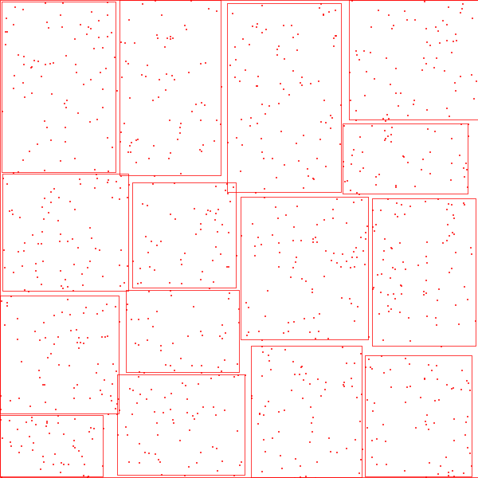
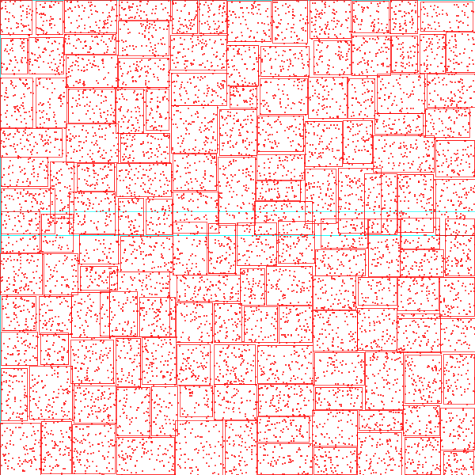
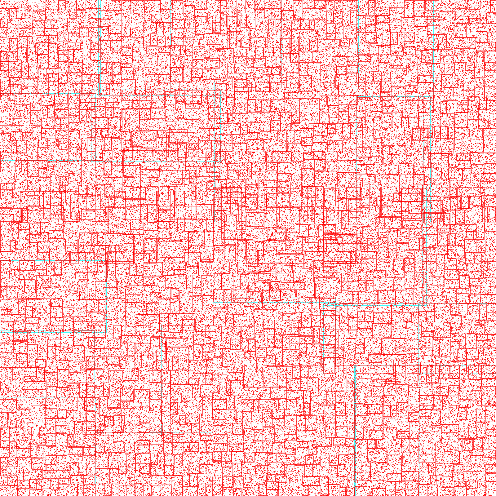
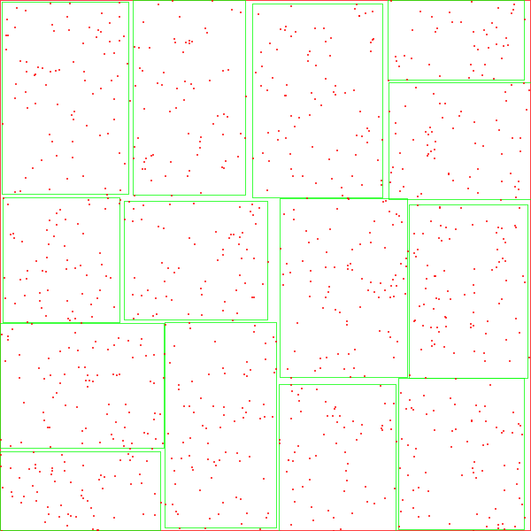
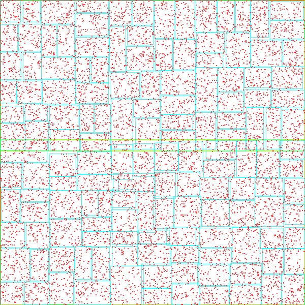
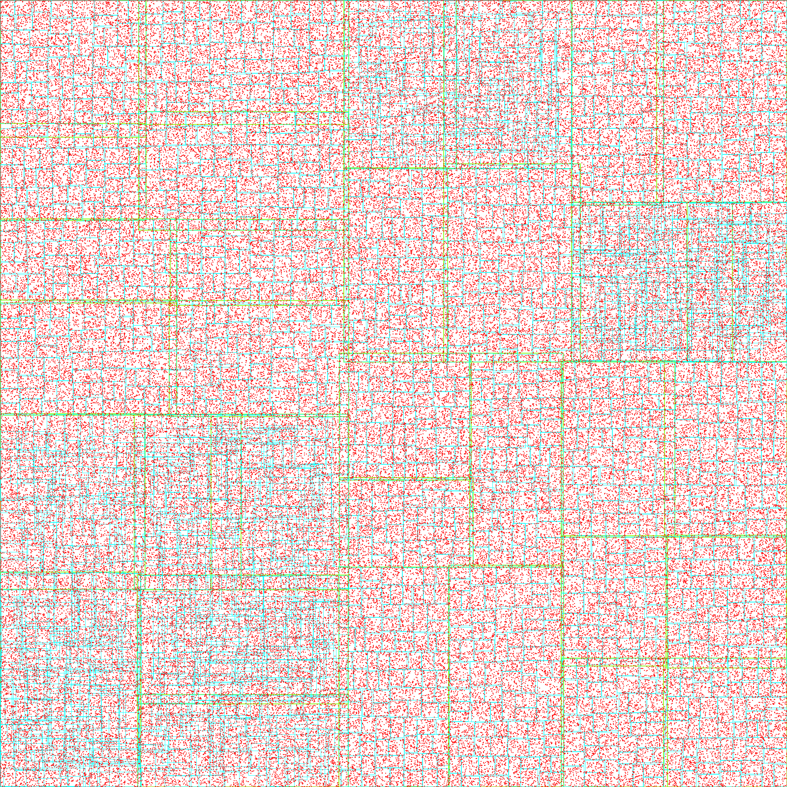

# SpatialIndices

## Done:
- [x] HilberCurve R-tree
- [x] ZCurve R-tree
- [x] R*-tree (Revisited Version without weight function.)
- [x] Recursive Learning R-tree
- [x] Partition Learning R-tree

## Coming:
- [ ] R-tree
- [ ] R+-tree
- [ ] KD-tree
- [ ] KDB-tree
- [ ] UB-tree
- [ ] Quadtree
- [ ] X-tree

## TODO
- [ ] Figures
- [ ] Data Generators
- [ ] Unit Test
- [ ] Comments

## Figures

Data set: Uniform distribution, M=100, m=40

| version |  num=1000   | num=10000  | num=160000  |
| ---- |  ----  | ----  | ----  |
|Revisited R*-tree|  |  |  |
|R*-tree|  |  | |

## References

### Existing R*tree repos:

*[R*-tree](http://chorochronos.datastories.org/?q=node/43)* from HKUST.

*[R*-tree and R-tree](https://github.com/davidmoten/rtree)*.

*[author of R*-tree](https://www.uni-marburg.de/fb12/arbeitsgruppen/dbs/downloads)

### Papers:

*[R*-tree paper](https://infolab.usc.edu/csci587/Fall2019/papers/p322-beckmann.pdf)*

*[new R*-tree paper](http://citeseerx.ist.psu.edu/viewdoc/download?doi=10.1.1.367.7273&rep=rep1&type=pdf)*
