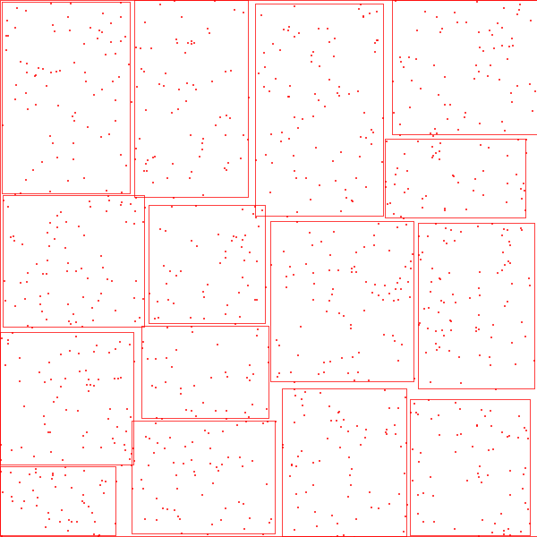
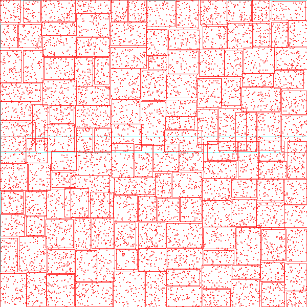
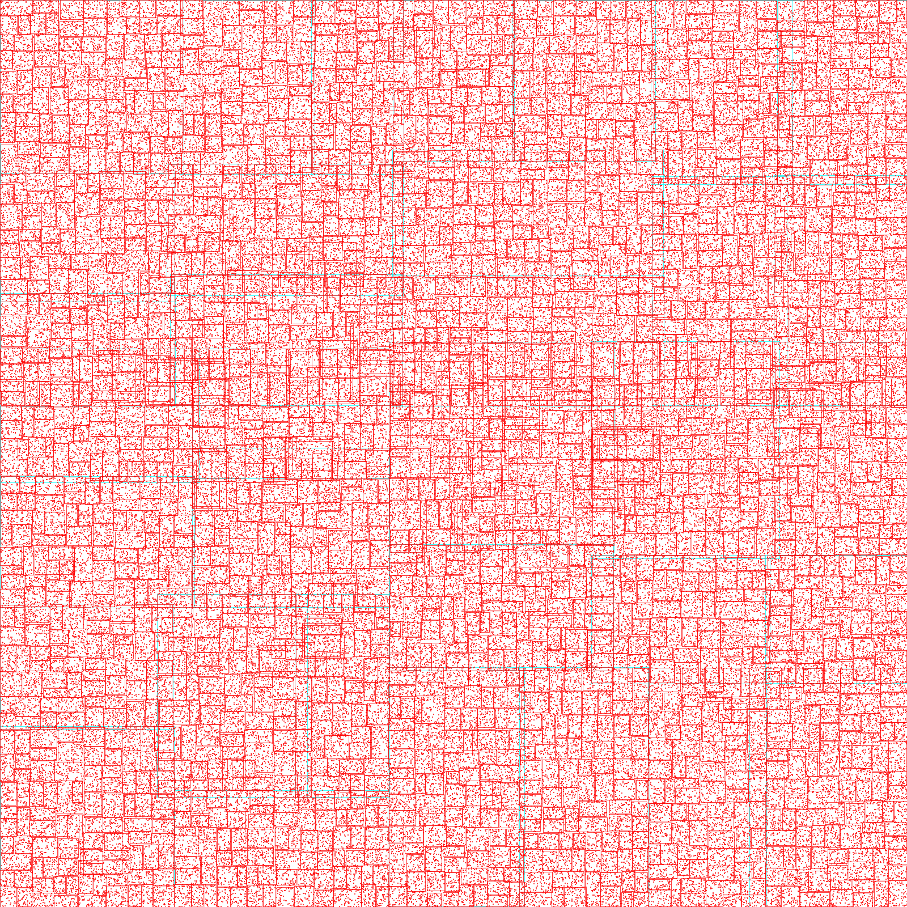

# SpatialIndices

## Done:
- [x] HilberCurve R-tree
- [x] ZCurve R-tree
- [x] R*-tree (Revisited Version without weight function.)

## Coming:
- [ ] KD-tree
- [ ] KDB-tree

## TODO
- [ ] Figures
- [ ] Data Generators
- [ ] Unit Test
- [ ] Comments

## Figures
|  num=1000   | num=10000  | num=160000  |
|  ----  | ----  | ----  |
|  |  |  |

## References

### Existing R*tree repos:

*[R*-tree](http://chorochronos.datastories.org/?q=node/43)* from HKUST.

*[R*-tree and R-tree](https://github.com/davidmoten/rtree)*.

### Papers:

*[R*-tree paper](https://infolab.usc.edu/csci587/Fall2019/papers/p322-beckmann.pdf)*

*[new R*-tree paper](http://citeseerx.ist.psu.edu/viewdoc/download?doi=10.1.1.367.7273&rep=rep1&type=pdf)*
